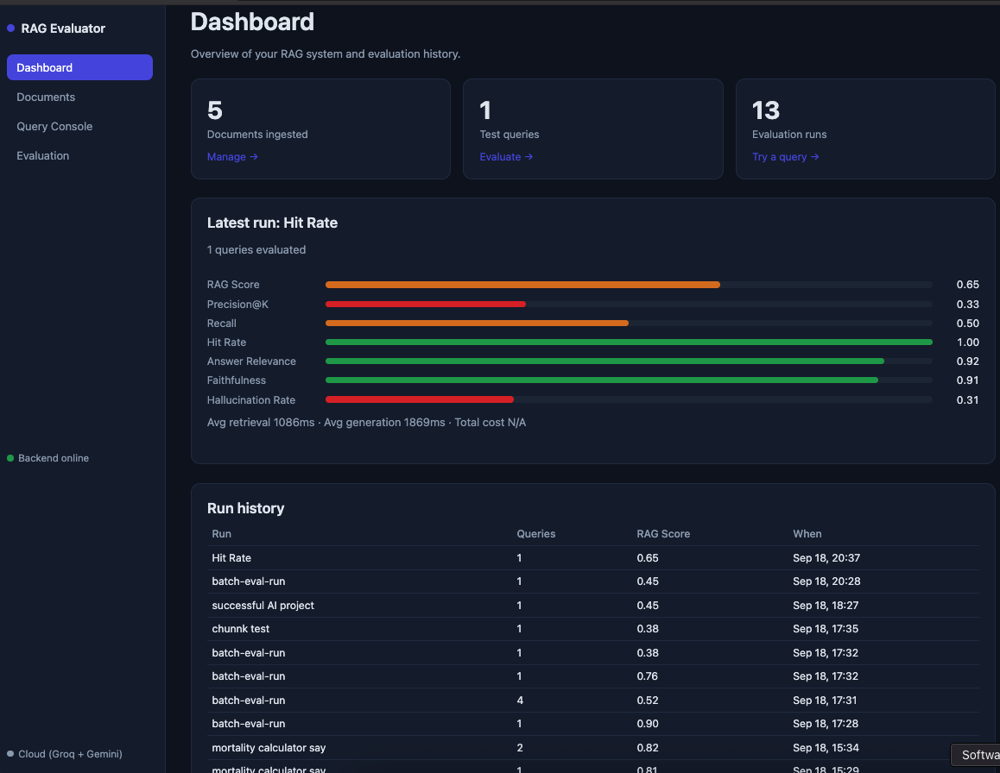

# RAG Quality Evaluator

A full-stack tool that doesn't just run a Retrieval-Augmented-Generation pipeline — it **scores how good that pipeline's answers actually are**, across 11 standard IR/RAG quality metrics plus approximate per-query cost, with a dashboard to compare configurations against each other.

Most RAG demos stop at "ask a question, get an answer." This one adds the layer most tutorials skip: **is the answer any good, and how do you know?**



## What it does

1. **Ingest** documents (pasted text or PDF upload) — chunked and embedded locally via Ollama (`nomic-embed-text`), or via Google Gemini in cloud mode.
2. **Query** them through a real RAG pipeline — retrieve relevant chunks (vector, keyword, or hybrid search), generate an answer via a local LLM (`mistral`) or Groq in the cloud.
3. **Evaluate** quality against ground-truth test queries: Hit Rate, Precision@K, Recall, MRR, NDCG, Answer Relevance, Faithfulness, Context Precision, Context Recall, Hallucination Rate, and a combined RAG Score — plus approximate $ cost per run.
4. **Compare** configurations — run the same test set with different top-K or retrieval strategy (pure vector search vs. keyword full-text search vs. a hybrid of both, fused with Reciprocal Rank Fusion) and see which one actually performs better, side by side.

## Architecture

```
Angular dashboard  ──HTTP/WS──>  Spring Boot API  ──>  PostgreSQL + pgvector
                                        │
                                        └──> Ollama (nomic-embed-text, mistral) — local
                                             or Groq + Gemini — cloud mode
```

- **Backend**: Java 21, Spring Boot 3.3, Spring Data JPA, raw WebSocket (no STOMP) for live evaluation progress.
- **Frontend**: Angular 22, standalone components + signals, no UI framework — hand-built, light/dark aware.
- **Storage**: PostgreSQL with the `pgvector` extension for embedding similarity search.
- **Models**: Ollama running locally by default — no API keys, no per-token cost, nothing leaves your machine. Optional cloud mode swaps in Groq (generation) + Gemini (embeddings), both free-tier, for environments where Ollama can't run.

## Why this exists

Built after researching real complaints from developers building RAG systems (Reddit, Stack Overflow): people ship RAG pipelines with no objective way to tell if retrieval is actually finding the right context, or if the LLM is quietly hallucinating past it. This tool is that missing measurement layer.

## Run it yourself (clone & go)

You don't need to read the code to try this — clone it, follow these steps, and it runs end to end.

### Option A — fully local (no API keys, nothing leaves your machine)

Prerequisites: Java 21, Maven, Node 20+, PostgreSQL with the `pgvector` extension, [Ollama](https://ollama.com).

```bash
# 1. Clone
git clone <this-repo-url>
cd rag-quality-evaluator

# 2. Database
psql -U postgres -c "CREATE DATABASE rag_evaluator;"
psql -U dev_user -d rag_evaluator -f schema.sql
# if upgrading an existing DB, also run the migrations in order:
psql -U dev_user -d rag_evaluator -f migrations/002_phase5_configurable_retrieval.sql

# 3. Ollama models
ollama serve
ollama pull nomic-embed-text
ollama pull mistral

# 4. Backend (defaults to LLM_PROVIDER=ollama — no .env needed)
mvn spring-boot:run       # http://localhost:8080

# 5. Frontend
cd frontend && npm install && npm start   # http://localhost:4200
```

Or, one command (Postgres + backend + frontend; Ollama still runs natively on your host):
```bash
docker compose up --build
```

### Option B — cloud mode (for free-tier hosting, or if you don't want to run Ollama locally)

Ollama needs 4-8GB RAM for a decent model — most free hosting tiers don't offer that. `LLM_PROVIDER=cloud` swaps Ollama for two free APIs instead, with zero other code changes:

```bash
cp .env.example .env
# then fill in .env:
#   GROQ_API_KEY=...     get one free at https://console.groq.com
#   GEMINI_API_KEY=...   get one free at https://aistudio.google.com/apikey
mvn spring-boot:run
```

`.env` is gitignored — your keys never get committed. See `.env.example` for every variable, including the optional `GROQ_PRICE_PER_M_*` pair for $ cost tracking (leave blank to skip cost computation; token counts are tracked either way).

### Try it end to end in under 2 minutes

Once the backend (and optionally frontend) is running:

```bash
# 1. Ingest a document
curl -X POST http://localhost:8080/rag/ingest -H "Content-Type: application/json" \
  -d '{"name":"demo","content":"Paste any text here.","source":"manual"}'

# 2. Load sample ground-truth test queries
curl -X POST http://localhost:8080/evaluation/seed-test-data

# 3. Run a full evaluation batch and see the scored results
curl -X POST http://localhost:8080/evaluation/batch-evaluate \
  -H "Content-Type: application/json" -d '{"topK":3,"retrievalMode":"VECTOR"}'
```

Or just open `http://localhost:4200` and use the dashboard directly.

## API reference

Full interactive docs at `http://localhost:8080/swagger-ui.html` once the backend is running. Highlights:

| Endpoint | Purpose |
|---|---|
| `POST /rag/ingest` | Ingest pasted text (`name`, `content`, `source`, optional `chunkSize`/`overlap`) |
| `POST /rag/ingest-pdf` | Ingest a PDF (multipart upload, text extracted via PDFBox) |
| `GET/DELETE /rag/documents` | List / delete ingested documents |
| `POST /rag/query` | Ask a question (`query`, optional `topK`, `retrievalMode`: `VECTOR`\|`KEYWORD`\|`HYBRID`) |
| `POST /evaluation/seed-test-data` | Load sample ground-truth test queries |
| `POST /evaluation/batch-evaluate` | Run all test queries through a given config, get scored + averaged |
| `GET /evaluation/runs` / `/results` | Run history and per-query results (also `/export` for CSV) |
| `WS /ws/evaluation-progress` | Live progress during a batch run |

## Metrics explained (and why each one is measured)

| Metric | What it measures | Why it's here |
|---|---|---|
| Hit Rate | Did at least one relevant chunk make it into the top-K? (yes/no) | Cheapest possible sanity check — if this is low, retrieval is fundamentally broken; no point reading the finer metrics yet |
| Precision@K | Of the top-K retrieved chunks, how many were actually relevant | Flags noisy retrieval — irrelevant chunks in the context can confuse or mislead generation |
| Recall / Context Recall | Of all relevant chunks that exist, how many were retrieved | Flags missing context — low recall means the answer is likely incomplete even if the model is honest |
| MRR | How early the first relevant chunk appears in the ranking | Hit Rate says "found or not", MRR says "found how quickly" — ranking quality matters for what the model sees first |
| NDCG | Overall ranking quality, rewarding relevant chunks appearing earlier | A stricter, position-weighted version of the same ranking-quality question as MRR |
| Answer Relevance | Semantic similarity between the question and the generated answer | Catches answers that are fluent but off-topic |
| Faithfulness | Embedding similarity between the answer and the retrieved context | A fast proxy for "does the answer stay grounded in the context" |
| Context Precision | How relevant the retrieved context is to the question | Same idea as Precision@K, computed via embeddings instead of ground-truth chunk IDs |
| Hallucination Rate | Of the individual claims in the generated answer, how many are NOT supported by the retrieved context (checked claim-by-claim via a separate LLM call) | The metric that actually matters most for trust — Faithfulness can be fooled by topical similarity; this checks each claim directly |
| RAG Score | Weighted combination of the above into one number | One comparable number to rank configurations against each other |
| Cost (per query / per run) | Approximate $ cost from input/output token counts | Solo-founder budget constraint — accuracy alone isn't enough if a config isn't affordable to run at scale |

## Testing — structural RAG stress test

Beyond the seeded ground-truth queries, ingestion and retrieval were manually stress-tested against a 5-document test pack from [ExamplePDF's RAG test corpus](https://examplepdf.com/tests/rag/) — purpose-built PDFs with placeholder (lorem-ipsum) text where the *structure*, not the content, is what's under test:

| File | Structure being tested |
|---|---|
| `paper-style.pdf` | Two-column layout, abstract, numbered sections, footnotes, references |
| `slides-style.pdf` | 15 sparse pages, large titles, short bullets |
| `report-style.pdf` | Table of contents, nested headings, a data table, a chart-as-image page |
| `contract-style.pdf` | Numbered clauses, dense justified text, a signature block |
| `headers-footers-variant.pdf` | A repeating running header + page numbers |

Because the text itself is meaningless placeholder content, the test queries are deliberately structural — split into **positive scenarios** (a clean, unambiguous answer should come back — e.g. "What was the Output value for Division Beta?" from the report's table) and **negative/trap scenarios** designed to catch hallucination and bad chunking specifically:

- Asking about a clause/reference/slide number that **doesn't exist** (clause 9, reference [5], slide 16) — correct behavior is to say so, not invent an answer.
- Asking the system to explain a **TOC line** or an **image/chart page** as if it were body content — correct behavior is to recognize it isn't real prose, not fabricate one.
- Asking about the **repeating header/footer** text — checks whether it was stripped before chunking or is leaking into retrieved context.
- Asking for a **two-column page read in order** — checks whether column order is preserved or the extractor interleaves lines from both columns.

**Findings from this round of manual testing** (kept here deliberately, not swept under the rug — this is what the stress test is for):

- ✅ TOC lines are correctly *not* treated as body content — a query aimed at tricking the system into answering from the "Operations ....... 3" TOC line instead returned the real Operations section text.
- ⚠️ Header/footer handling is inconclusive from a single query — the system avoided hallucinating when asked about the repeating "Journal of Synthetic Studies · Vol. 12 · No. 3" header, but didn't demonstrate the header had actually been stripped out of the chunk. Needs a follow-up query (e.g. "how many times does this header text repeat across the document?") to confirm one way or the other.
- ❌ **Known issue — cross-document retrieval leak:** a query scoped to `paper-style.pdf`'s two-column page returned fragments that actually belong to `slides-style.pdf`, with no indication anything was wrong. Root cause suspected to be querying across all ingested documents at once without a `documentId` filter, combined with lorem-ipsum placeholder text being generic enough that embeddings from an unrelated file scored as a top match. Fix in progress: scope `/rag/query` to a specific document when one is intended, and/or tighten similarity thresholds.
